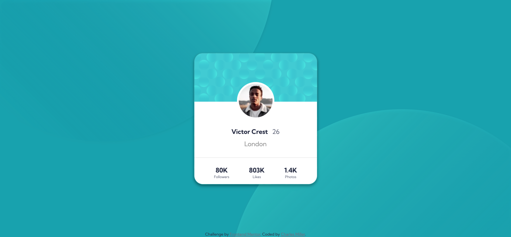

# Frontend Mentor - Profile card component solution

This is a solution to the [Profile card component challenge on Frontend Mentor](https://www.frontendmentor.io/challenges/profile-card-component-cfArpWshJ). Frontend Mentor challenges help you improve your coding skills by building realistic projects.

## Table of contents

- [Frontend Mentor - Profile card component solution](#frontend-mentor---profile-card-component-solution)
  - [Table of contents](#table-of-contents)
  - [Overview](#overview)
    - [The challenge](#the-challenge)
    - [Screenshot](#screenshot)
    - [Links](#links)
  - [My process](#my-process)
    - [Built with](#built-with)
    - [What I learned](#what-i-learned)
  - [Author](#author)

**Note: Delete this note and update the table of contents based on what sections you keep.**

## Overview

### The challenge

-   Build out the project to the designs provided

### Screenshot



### Links

-   Solution URL: [Add solution URL here](https://github.com/charlesmiller0412/profileCard)
-   Live Site URL: [Add live site URL here](https://charlesmiller0412.github.io/profileCard/)

## My process

I took this somewhat simple project as an opportunity to expand on some NPM practice. Once I ensured NPM and live-server was up to date I created a project and installed node-sass, Bootstrap, jQuery, and popperJS for dependency.

At this point I was ready to start the project and determined I the best naming method to use with SCSS was BEM. I then mapped out all sections and divs according to element and began styling. This was my first time using ::before and ::after for the background and provided a decent challenge.

### Built with

-   NPM
-   Sass (SCSS)
-   Bootstrap
-   Semantic HTML5 markup
-   CSS custom properties
-   BEM Methodology (Block Element Modifier)
-   Mobile-first workflow

### What I learned

Use this section to recap over some of your major learnings while working through this project. Writing these out and providing code samples of areas you want to highlight is a great way to reinforce your own knowledge.

To see how you can add code snippets, see below:

```css
.main__wrapper {
    filter: drop-shadow(0px 4px 4px rgba(0, 0, 0, 0.25));
    -webkit-filter: drop-shadow(0px 4px 4px rgba(0, 0, 0, 0.25));

    // background bubbles
    &::before {
        content: "";
        background-image: url("/assets/images/bg-pattern-top.svg");
        width: 1000px;
        height: 1000px;
        bottom: 100px;
        right: 100px;
        position: absolute;
        z-index: -1;
        background-repeat: no-repeat;
    }
```

## Author

-   Website - [Charles Miller](https://www.charlesmiller.dev)
-   Frontend Mentor - [@charlesmiller0412](https://www.frontendmentor.io/profile/charlesmiller0412)
